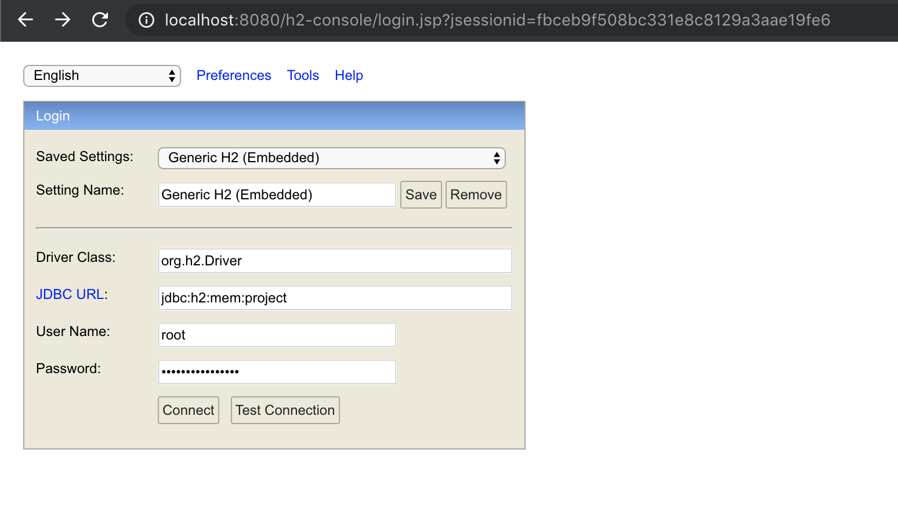

# SQL Injection

## Context

Consider a webapp that stores information about users and posts in two different tables as it can be seen in the following two excerpts taken from [`data.sql`](src/main/resources/data.sql):

```sql
INSERT INTO user (id, username, email, password) VALUES
  (1, 'admin', 'admin@site.internal', '(;C\b6Wva`9{:LYq'),
  (2, 'user1', 'user1@site.external', '[P:n@dzG?LF"T*2W'),
  (3, 'user2', 'user2@site.external', 'u_3AS8k%cxRN~u~q');
```

```sql
INSERT INTO post (id, slug, title, description) VALUES
  (1, 'post-a', 'Post A', 'Description A'),
  (2, 'post-b', 'Post B', 'Description B'),
  (3, 'post-c', 'Post C', 'Description C');
```

More details about the structure of the database can be found in the [h2-console](http://localhost:8080/h2-console/login.jsp) when the app is run. To log in, just use the credentials specified at [`application.yaml`](`src/main/java/resources/application.yaml`):




### Retrieving a post

The details of a post with a certain slug `post-a` could be retrieved using a simple `GET` request:

```bash
curl --request GET \
  --url http://localhost:8080/posts/post-a
```

The application would translate this request into the SQL query that is shown next:

```sql
SELECT id, slug, title, description
FROM posts
WHERE slug = 'post-a'
```

As a result, the information returned by the REST endpoint would be a simple list with the details of post `post-a`:


## Vulnerability

In order to understand this type of vulnerability, let's take a look at the code from [PostRepository.java](src/main/java/internal/appsec/validation/injection/sql/post/PostRepository.java) first:

```java
public List<Post> findBySlug(Integer currentUserId, String slug) {
    List<Post> posts = new ArrayList<>();

    // FIXME Use Spring JPA repository or prepareStatement instead of createStatement
    try (Connection connection = DriverManager.getConnection(databaseConfiguration.getUrl(),
            databaseConfiguration.getUser(), databaseConfiguration.getPassword());
            Statement statement = connection.createStatement();
            ResultSet resultSet = statement.executeQuery(
                    "SELECT p.id AS id, p.slug AS slug, p.title AS title, p.description AS description" +
                    " FROM posts p, user_posts up" +
                    " WHERE p.id = up.post_id" +
                    " AND up.user_id = " + currentUserId +
                    " AND slug = '" + slug + "'")
    ) {
        while (resultSet.next()) {
            posts.add(mapToPost(resultSet));
        }
    } catch (SQLException e) {
        log.error("Error reading post {} from database", slug, e);
    }

    return posts;
}
```

As it can be seen,, the repository is concatenating the slug of the post in the SQL query, which is vulnerable to SQL injection attacks.

Taking a look at the information provided by SonarQube,

TODO Add screenshot from SonarQube.


## Exploit

### Retrieve all posts

Since the application was vulnerable to SQL injection, the original query could be altered to retrieve all categories written by any user:

```bash
curl --request GET \
  --url http://localhost:8080/posts/post-a%27%20OR%20%271%27%20=%20%271
```

This request would be translated into the following SQL query:

```sql
SELECT id, slug, title, description
FROM posts
WHERE slug = 'post-a'
  OR '1' = '1'
```

As a result, all categories stored in the database would be returned to the user:


## Retrieve all users

This type of attack could be used to even retrieve sensitive information about the users registered into the application, emails and passwords included:

```bash
curl --request GET \
  --url 'http://localhost:8080/posts/post-a%27%20UNION%20SELECT%20id,%20username,%20email,%20password%20FROM%20users%20WHERE%20%271%27=%20%271'
```

This request would generate a SQL query that would join the `categories` and `users` tables:

```sql
SELECT id, slug, title, description
FROM posts
WHERE slug = 'post-a'
UNION
SELECT id, username, email, password
FROM users
WHERE '1' = '1'
```

As it is shown in the following picture, the attacker would have access to all the credentials stored in the database:


## Secure code

### Using JpaRepository

```java
@Repository
public interface PostRepository extends JpaRepository<Post, Integer> {
    List<Post> findBySlug(String slug);
}
```

### Using custom queries

```java
@Repository
public interface PostRepository extends JpaRepository<Post, Integer> {
    @Query("SELECT new Post(id, slug, title, description) FROM Post WHERE slug = ?1")
    List<Post> findBySlug(String slug);
}
```

### Using PreparedStatement

```java
class PostRepository {
    public List<Post> findBySlug(Integer currentUserId, String slug) {
        List<Post> posts = new ArrayList<>();

        try (Connection connection = DriverManager.getConnection(databaseConfiguration.getUrl(),
                databaseConfiguration.getUser(), databaseConfiguration.getPassword());
             PreparedStatement preparedStatement = connection.prepareStatement(
                     "SELECT p.id AS id, p.slug AS slug, p.title AS title, p.description AS description" +
                             " FROM posts p, user_posts up" +
                             " WHERE p.id = up.post_id" +
                             " AND up.user_id = ?" +
                             " AND slug = ?"
             )
        ) {
            preparedStatement.setInt(1, currentUserId);
            preparedStatement.setString(2, slug);

            try (ResultSet resultSet = preparedStatement.executeQuery()) {
                while (resultSet.next()) {
                    posts.add(mapToPost(resultSet));
                }
            }
        } catch (SQLException e) {
            log.error("Error reading post {} from database", slug, e);
        }

        return posts;
    }
}
```
