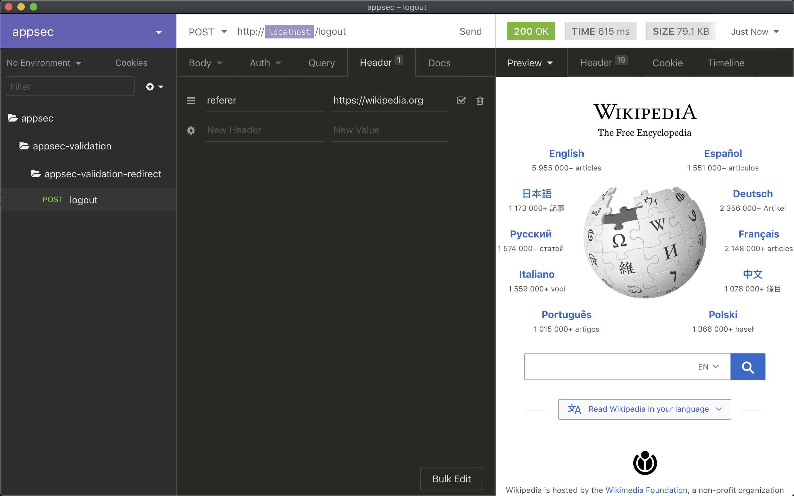
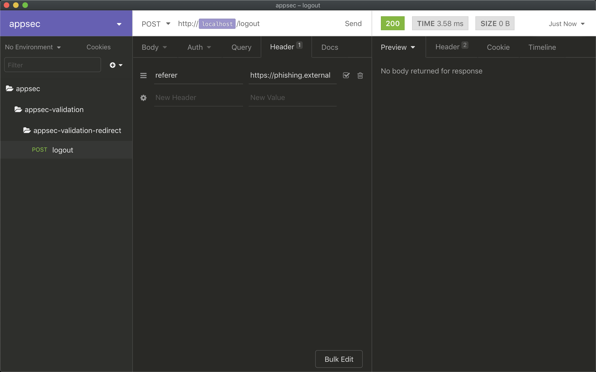

# Unvalidated Redirects

## Context

## Vulnerability

## Exploit

## Whitelisted referer

```bash
curl --request POST \
  --url http://localhost:8080/logout \
  --header 'referer: https://wikipedia.org'
```



### Request

```yaml
> POST /logout HTTP/1.1
> Host: localhost:8080
> User-Agent: insomnia/6.6.0
> referer: https://wikipedia.org
> Accept: */*
> Content-Length: 0
```

### Response

```yaml
< HTTP/1.1 302
< Location: https://wikipedia.org
< Content-Length: 0
< Date: Sun, 27 Oct 2019 19:42:33 GMT
```

## Non-whitelisted referer

```bash
curl --request POST \
  --url http://localhost:8080/logout \
  --header 'referer: https://phishing.external'
```



### Request

```yaml
> POST /logout HTTP/1.1
> Host: localhost:8080
> User-Agent: insomnia/6.6.0
> referer: https://phishing.external
> Accept: */*
> Content-Length: 0
```

### Response

```yaml
< HTTP/1.1 200
< Content-Length: 0
< Date: Sun, 27 Oct 2019 19:45:51 GMT
```
