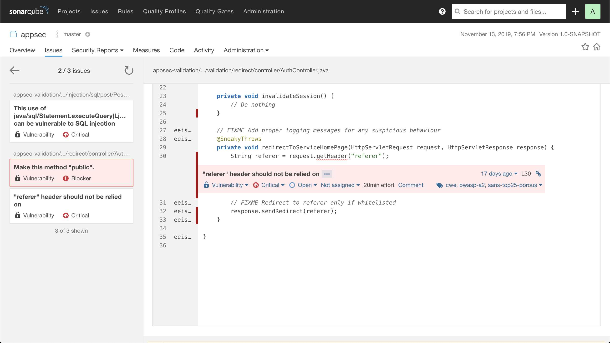
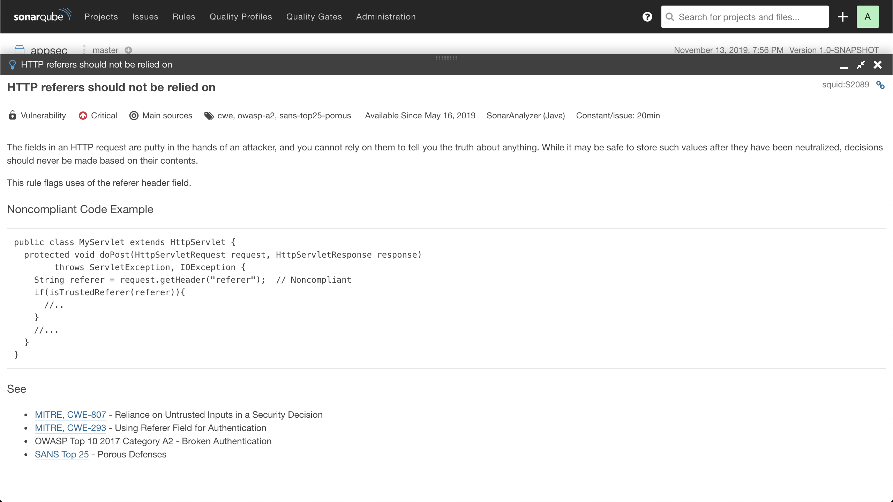

# Unvalidated Redirects

## Context

Consider an auth service that can be used by other services to authenticate users. For the sake of simplicity, this vulnerability analysis will not take into account the login side of the auth service but only the logout one. When a user is logged out, his session has to be invalidated and he has to be redirected to a certain homepage which will depend on the specific service that originated the request.

One the auth service has been started, a user can be logged out with a simply HTTP request:

```bash
curl --request POST \
  --url http://localhost:8080/logout \
  --header 'referer: https://wikipedia.org'
```

This request contains an HTTP header attribute named `referer`. If the referrer is considerer safe (it has been whitelisted in advance), the user will redirected to it after being logged out. The following picture shows how the user was redirected to the Wikipedia homepage:


```yaml
> POST /logout HTTP/1.1
> Host: localhost:8080
> User-Agent: insomnia/6.6.0
> referer: https://wikipedia.org
> Accept: */*
> Content-Length: 0
```

```yaml
< HTTP/1.1 302
< Location: https://wikipedia.org
< Content-Length: 0
< Date: Sun, 27 Oct 2019 19:42:33 GMT
```

## Vulnerability

This vulnerability is caused by how the `AuthController` is handling the redirection. As it can be seen in the `redirectToServiceHomePage` method, the controller blindly relies on the `referer` header, which could be manipulated by an attacker to redirect the user to a phishing website, for instance:

```java
@RestController
class AuthController {

    // FIXME Get whitelisted referers from application resources
    String[] whitelistedReferers;

    @PostMapping(value = "/logout")
    void logout(HttpServletRequest request, HttpServletResponse response) {
        invalidateSession();
        redirectToServiceHomePage(request, response);
    }

    private void invalidateSession() {
        // Do nothing
    }

    // FIXME Add proper logging messages for any suspicious behaviour
    @SneakyThrows
    private void redirectToServiceHomePage(HttpServletRequest request, HttpServletResponse response) {
        String referer = request.getHeader("referer");
        // FIXME Redirect to referer only if whitelisted
        response.sendRedirect(referer);
    }

}
```

Taking a look at [SonarQube](https://www.sonarqube.org/), the report makes it clear that the `"referer" header should not be relied on`:



The proposed solution is to check that the header provided in the request contains a trusted referrer:



## Exploit

Now let's consider that the original referer header is modified by a malicious attacker so that it is not whitelisted anymore. An scenario like this one could be tested for example in Chrome using some extension such as [Referer Control](https://chrome.google.com/webstore/detail/referer-control/hnkcfpcejkafcihlgbojoidoihckciin?hl=es-419). For our purposes, a request to the endpoint is more than enough:

```bash
curl --request POST \
  --url http://localhost:8080/logout \
  --header 'referer: https://phishing.external'
```

In order to prevent the user from being redirected to the external malicious website `https://phishing.external`, the referrer should be validated against a list of trusted referrers. The final objective must be preventing this kind of redirections from happening, so a simple 200 response could be enough in most of the cases:


```yaml
> POST /logout HTTP/1.1
> Host: localhost:8080
> User-Agent: insomnia/6.6.0
> referer: https://phishing.external
> Accept: */*
> Content-Length: 0
```

```yaml
< HTTP/1.1 200
< Content-Length: 0
< Date: Sun, 27 Oct 2019 19:45:51 GMT
```

## Secure code challenge

To fix this type vulnerability, specify a hardcoded list of trusted referrers in a resource file and use it to validate the referrer specified by the HTTP request. Bear in mind that simple substring checkings would not be enough as it is shown in the unit tests that have already been implemented in [`AuthControllerTest.java`](src/test/java/internal/appsec/validation/redirect/controller/AuthControllerTest.java):

```java
static Stream<Arguments> shouldLogoutAndNotRedirectToNonWhitelistedReferrers() {
    return of(
            arguments("http://phishing.external/"),
            arguments("http://phishing.external?referer=https://www.wikimedia.org/"),
            arguments("http://phishing.externalwikimedia.org/"),
            arguments(" "),
            arguments(""),
            arguments((Object) null)
    );
}
```